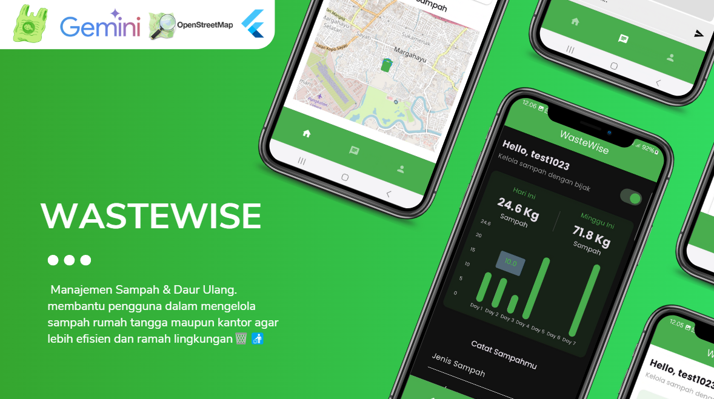
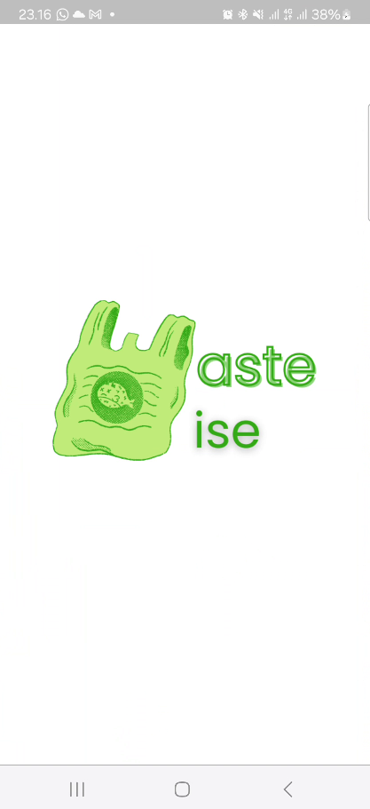
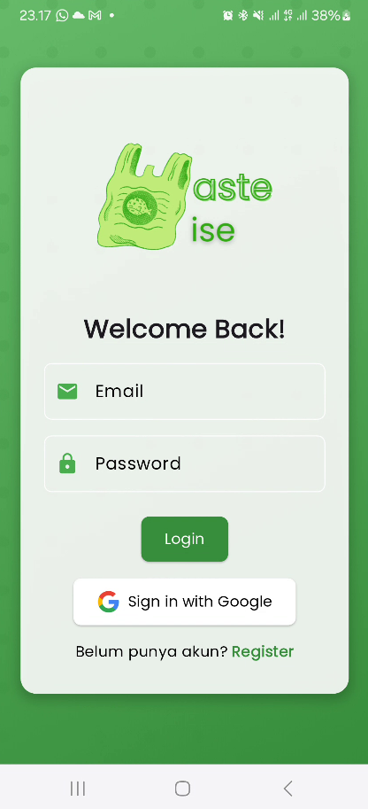
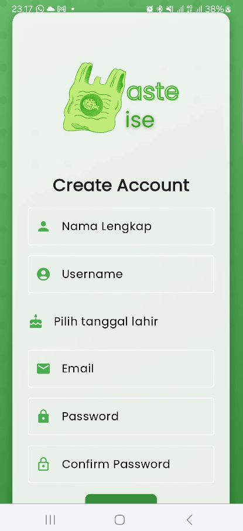
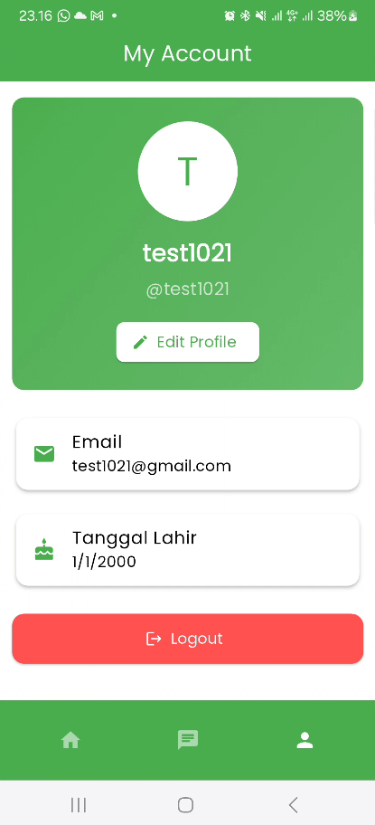
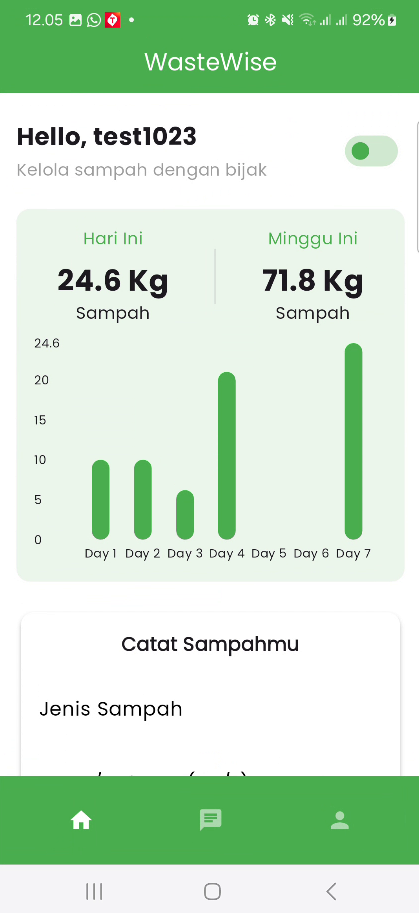
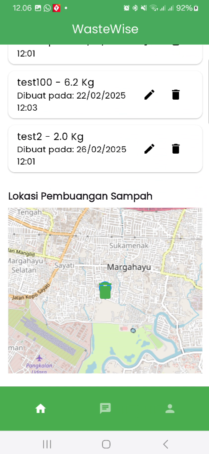
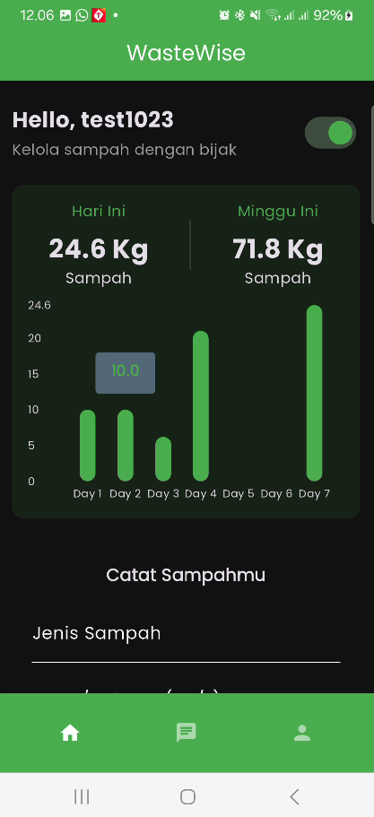
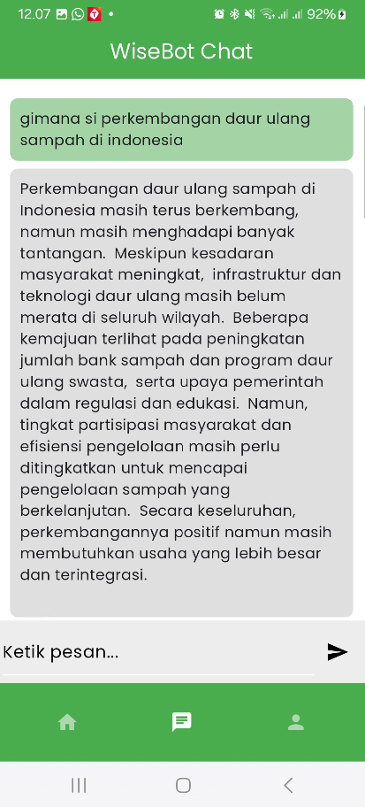

# WasteWise

Aplikasi **WasteWise** — Manajemen Sampah & Daur Ulang

## Gambaran Singkat
Aplikasi **WasteWise** membantu pengguna dalam mengelola sampah rumah tangga maupun kantor agar lebih efisien dan ramah lingkungan. Aplikasi ini memungkinkan pengguna untuk mencatat jenis sampah, memantau jadwal pengumpulan, serta memperoleh informasi mengenai cara daur ulang. Tujuan akhirnya adalah mengurangi volume sampah yang dibuang dan meningkatkan tingkat daur ulang.

## Fitur Utama

1. **Splash Screen**: Menggunakan `flutter_native_splash`.
2. **Autentikasi**: Firebase Authentication (Email/Password) dan google login.
3. **Local Storage**: SharedPreferences untuk menyimpan sesi `isLoggedIn`.
4. **CRUD Data Sampah**: Menggunakan Cloud Firestore.
5. **API**: Gemini (untuk chatBotnya) dan lokasi pembuangan memakai openStreetMap API
6. **State Management**: GetX.
7. **Tema**: Dark & Light mode bertema warna hijau. Font Poppins.

## Cara Install & Menjalankan

1. Clone repository:
   ```bash
   git clone https://github.com/yourname/wastewise.git
   ```

2. Masuk ke folder proyek:
   ```bash
   cd wastewise
   ```

3. Install dependency:
   ```bash
   flutter pub get
   ```

4. Setup Firebase:
   - Buat project di Firebase Console.
   - Download google-services.json dan GoogleService-Info.plist.
   - Letakkan di folder android/app/ dan ios/Runner/.
   - Update build.gradle dan AndroidManifest.xml sesuai instruksi.

5. Generate splash screen:
   ```bash
   flutter pub run flutter_native_splash:create
   ```

6. Jalankan app:
   ```bash
   flutter run
   ```

## Flow Aplikasi

- Splash Screen akan cek status login (dari SharedPreferences).
- Jika isLoggedIn = true, langsung ke Dashboard/Home.
- Jika belum login, user akan diarahkan ke halaman Login.
- Di halaman Login, user bisa memasukkan email & password, atau pindah ke Register.
- Setelah login sukses, user diarahkan ke Home.
- Di Home, user bisa menambahkan catatan sampah, melihat daftar, mengedit, atau menghapus.
- Data catatan sampah disimpan di Firestore di koleksi users/{uid}/wastes.

## Struktur Folder

Lihat di dokumentasi folder.

## Tambah / Update / Delete Catatan Sampah

- Tambah sampah: Tekan tombol + (icon di AppBar), isi form, klik simpan.
- Update sampah: Tekan list item, form edit muncul, update, simpan.
- Hapus sampah: Tekan icon delete pada list item.

## Screenshot

| Nama Page | Deskripsi | Screenshot                                                                                                                       |
|-----------|-----------|----------------------------------------------------------------------------------------------------------------------------------|
| SplashScreen | Halaman awal yang muncul saat aplikasi pertama kali dibuka. Fitur utama: <br>- Menampilkan logo WasteWise<br>- Otomatis mengecek status login pengguna dari SharedPreferences<br>- Melakukan navigasi ke halaman Login atau Home setelah 2 detik |  |
| Login & Register | Halaman untuk autentikasi pengguna. Fitur utama: <br>- Form login dengan email dan password<br>- Opsi login dengan Google<br>- Link navigasi ke halaman Register<br>- Background gradient dan polka dot animasi<br>- Form Register dengan validasi input (nama lengkap, username, tanggal lahir, email, password)<br>- Validasi konfirmasi password<br>- Register manual atau dengan Google | <br> |
| AccountPage | Halaman untuk mengelola profil pengguna. Fitur utama: <br>- Tampilan profil dengan avatar inisial nama<br>- Informasi nama lengkap dan username<br>- Tombol edit profil<br>- Detail informasi akun (email, tanggal lahir)<br>- Tombol logout<br>- Custom bottom navigation bar |  |
| HomePage | Halaman utama yang menampilkan analitik sampah, formulir pencatatan sampah, daftar sampah yang sudah dicatat, dan peta lokasi pembuangan. Fitur utama: <br>- Tampilan greeting dengan nama pengguna<br>- Toggle dark/light mode<br>- Analitik sampah harian dan mingguan<br>- Form input sampah (jenis dan berat/volume)<br>- Daftar sampah dengan fungsi edit dan hapus<br>- Peta lokasi pembuangan sampah | <br><br> |
| WiseBot | Halaman chatbot yang memungkinkan pengguna untuk berinteraksi dengan WiseBot AI. Pengguna dapat menanyakan berbagai informasi tentang pengelolaan sampah, tips daur ulang, dan praktik ramah lingkungan lainnya. |                                                                                     |

## Penutup